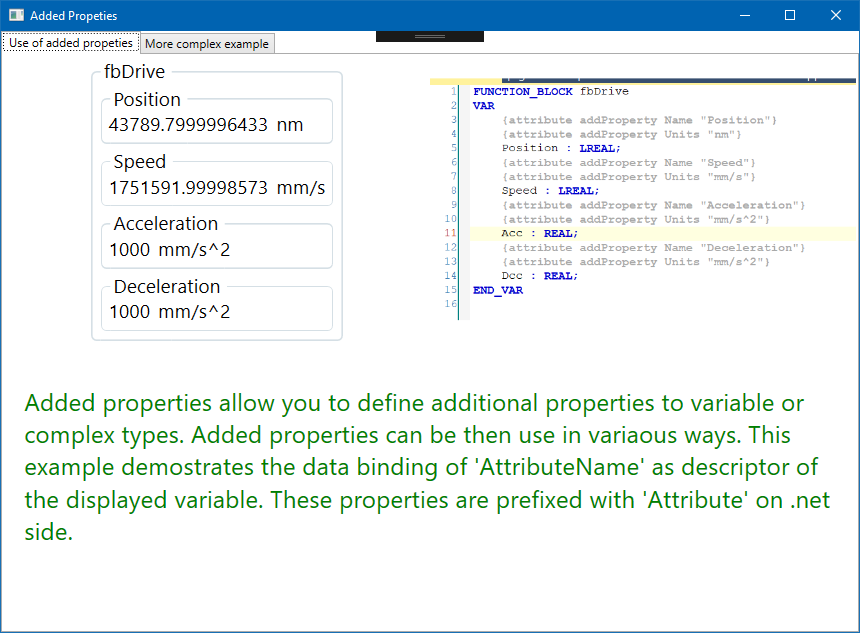
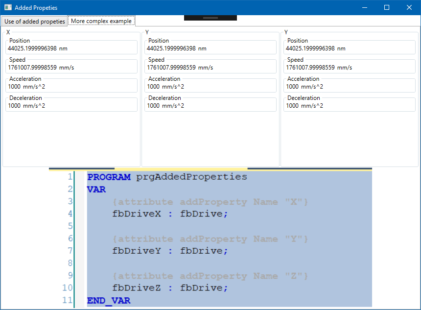

#  AddedProperties

This example is trying to expose the feature that allows you to introduce additional properties to twin objects in the PLC code. This feature is part of wider idea that is called "Single Point of Change" (SPOC).

> In short SPOC tends to keep the changes in a single place (which in this instance is the source code of the PLC program), later in more advanced packages we will show how this concept keeps the solutions clean and consistent yet at the same time it takes a lot of workload away from the developer.

# How it looks like

Inxton is reading the variable from PLC and displaying it
## Simple example

## Nested example

# Need help?

🧪 Create an issue [here](https://github.com/Inxton/Feedback/issues/new/choose)

📫 We use mail too team@inxton.com 

🐤 Contact us on Twitter [@Inxton](https://twitter.com/inxtonteam)

📽 Checkout our [YouTube](https://www.youtube.com/channel/UCB3EcnWyLSsV5gqSt8PRDXA/featured)

🌐 For more info check out our website [INXTON.com](https://www.inxton.com/)

# Contributing

We are more than happy to hear your feedback, ideas!
Just submit it [here](https://github.com/Inxton/Feedback/issues/new/choose)  

# License
tldr
> Developers are encouraged to use this project -  free of charge, although when you want to use it in production enviroment you need to go to  [INXTON.com](https://www.inxton.com/) and purchase a licence.

to make our lawyers happy - read the whole licence agreement [here](https://github.com/Inxton/about/blob/master/license.md)

---
Developed with ♥ at [MTS](https://www.mts.sk/) - putting the heart into manufacturing.
 
