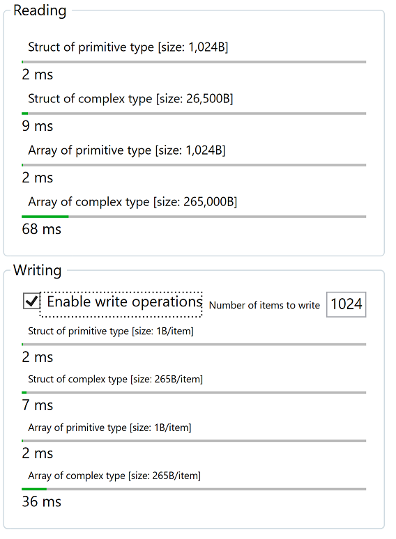
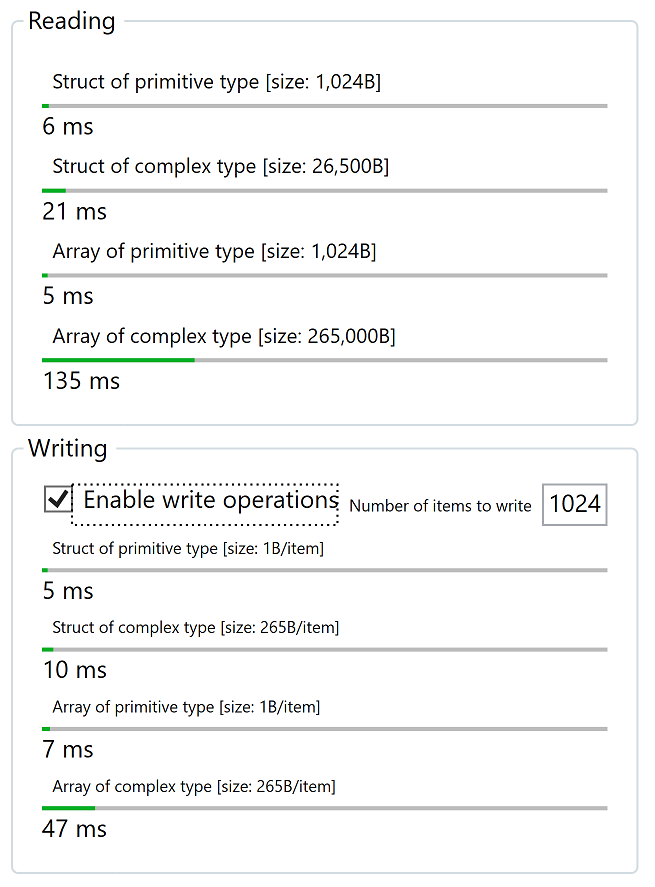

**N.B. ALL EXAMPLES ARE NOW IN VS2019 FORMAT**
 
## Read/Write Performance tests

Use this application to test your setup for performance with Inxton.

In gerenal Inxton is fast when it comes to handling data. There are different ways you can access data over PLC twin Connector (cyclical, synchronous, batched, [more here](https://docs.inxton.com/docu/articles/units/Inxton.Vortex.Connector/Conceptual/PrimitiveTwins.html)). In this application we only emulate the cyclical reading and writing of structures with different composition and size. The prefromance of the application will mostly depend on:
- Target's performance
- Network latency (if application does not run on local target)
- Application's hardware performance parameters
- Size and prefromance requirements of the application
- Number of concurrent accesses per unit of time from applications to target

Here are some scenarios:

### Scenario #1 Local Target

- Both PLC and Inxton Application run on [DELL PRECISION TOWER 5810](https://www.dell.com/us/dfb/p/precision-t5810-workstation/pd)

### Scenario #2 Remote Target

- Plc program runs on Remote Target [PLC CX2040](https://www.beckhoff.com/en-us/products/ipc/embedded-pcs/cx20x0-intel-celeron-core-i7/cx2040.html) 
- Application runs on [DELL PRECISION TOWER 5810](https://www.dell.com/us/dfb/p/precision-t5810-workstation/pd)

# Need help?

🧪 Or create an issue [here](https://github.com/Inxton/Feedback/issues/new/choose)

📫 We use mail too team@inxton.com 

🐤 Contact us on Twitter [@Inxton](https://twitter.com/inxtonteam)

📽 Checkout our [YouTube](https://www.youtube.com/channel/UCB3EcnWyLSsV5gqSt8PRDXA/featured)

🌐 For more info check out our website [INXTON.com](https://www.inxton.com/)

# Contributing

We are more than happy to hear your feedback, ideas!
Just submit it [here](https://github.com/Inxton/Feedback/issues/new/choose)  

# License
tldr
> Developers are encouraged to use this project -  free of charge, although when you want to use it in production enviroment you need to go to  [INXTON.com](https://www.inxton.com/) and purchase a licence.

to make our lawyers happy - read the whole licence agreement [here](https://github.com/Inxton/about/blob/master/license.md)

---
Developed with ♥ at [MTS](https://www.mts.sk/) - putting the heart into manufacturing.
 
