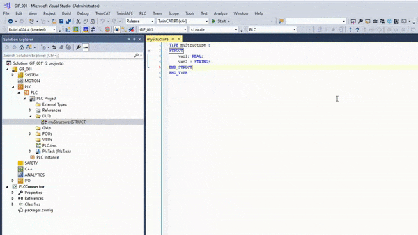
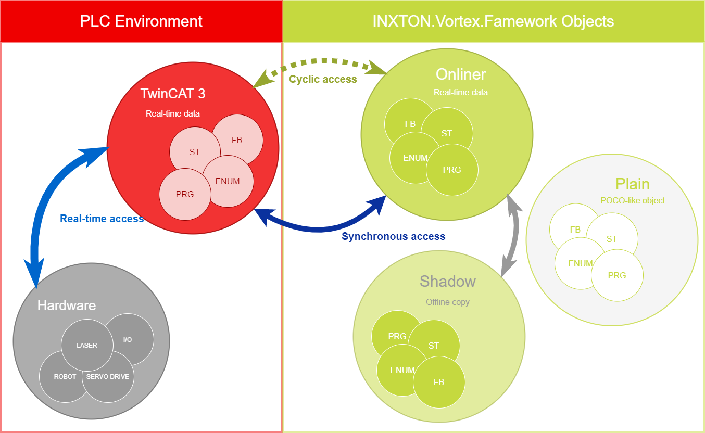
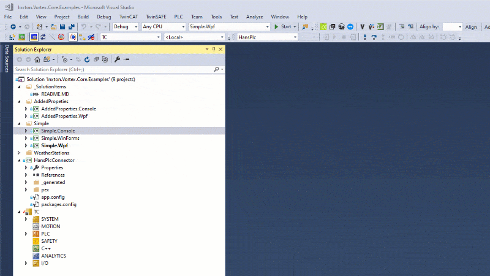
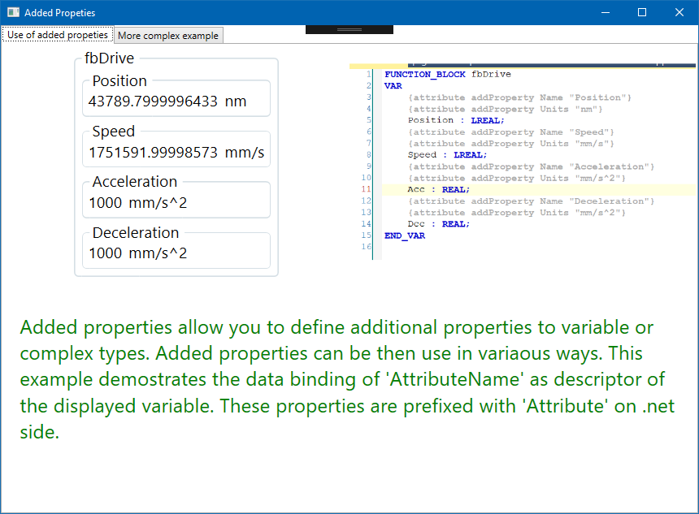
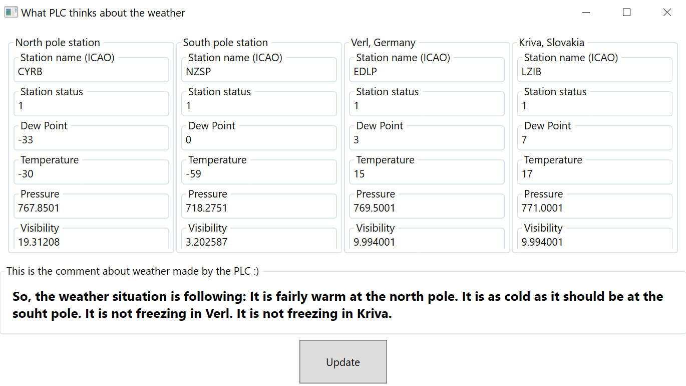

Nowadays Programmable Logic Controllers (PLC) are required to do more than ever before. Access database, make HTTP requests, build JSONs - stuff they were never meant to do. Even though it's possible, the PLC code is repetitive and hard to navigate, forcing the programmers to spend too much time fixing errors instead of focusing on improvements.
 
Thanks to Inxton.Vortex.Framework, you can use a high-level programming language like C# to make your solution more efficient and easier to operate. Use the PLC for what it was designed to do and leave all the advanced problems to a modern environment like .NET.

# About this example projects

These examples aim to present the use and capabilities of *Inxton.Package.Vortex.Core* that is a basic, but powerful set of tools that allow you to interact with Beckhoff TwinCAT3 PLC data from .NET (e.g. C#, VB, etc) in a fast and scalable way. This package is part of *Inxton.Vortex.Framework*.


## Compiler

*Inxton.Vortex.Compiler* is the founding block of the Inxton.Vortex.Framework. It provides one to one C# objects from the TwinCAT3 PLC program so you can use any .NET based platform to access PLC data.

TwinCAT 3 project that contains ```HansPlc``` program will be translated into a .NET project called ```HansPlcConnector```. This is the bridge between TwinCAT 3 PLC and .NET. 

`HansPlcConnector` contains `TwinObjects` - .NET representation of a complex PLC data type (STRUCT, UNION, FB, GVL, PRG). Each of these data structures is represented by a standalone C# class with the same name and attributes as its PLC counterpart. The root class that represents the `HansPlc` (the actual PLC project) is `HansPlcTwinController`.



Learn more about compiler [here](https://github.com/Inxton/documentation/tree/master/apis/Inxton.vortex.compiler.console).

Learn more about `TwinObject` [here](https://github.com/Inxton/documentation/blob/master/apis/Inxton.vortex.compiler.console/Conceptual/TwinObjects.md)

## Accessing the PLC data

Autogenerated code in `HansPlcConnector` project gives you structured access to PLC data in various forms via `TwinObject`. This object contains respective primitive variables as `TwinPrimitive`(s) and can have nested other `TwinObject`(s) of its PLC counterpart. The default entry point to the twin objects of the PLC program is the [TwinController](https://github.com/Inxton/documentation/blob/master/apis/Inxton.vortex.compiler.console/Conceptual/TwinController.md) object.

Each `TwinObject` implements `IOnline` and `IShadow` interfaces to access its `TwinPrimitives` and  `TwinObjects`.

- `IOnline` interface which exposes members with direct communication ability with the PLC system.
    - **Cyclic access** - two-way access to the PLC variables. Cyclic values are being read and written in an optimized periodic loop. 
    - **Synchronous access** - immediate two-way access to the PLC variable.

 - `IShadow` interface allows an offline manipulation of the object's data.

There is a separate class Plainer that is produced during the trans-piling process which is light (POCO like) representation of the same data structure, that can be is used in scenarios involving serialization.



Learn more about `TwinPrimitives` [here](https://github.com/Inxton/documentation/blob/master/apis/Inxton.Vortex.Connector/Conceptual/PrimitiveTwins.md).

# Getting started

## Check the prerequisites

Make sure you have everything you need to start using examples in this repository [here](https://github.com/Inxton/documentation/blob/master/common/PREREQUISITES.md).

## Clone this repository

~~~ bash
git clone https://github.com/Inxton/Examples-Inxton.Package.Vortex.Core.git
~~~

Or download zip [here](https://github.com/Inxton/Examples-Inxton.Package.Vortex.Core/archive/master.zip)

## Open the solution

 ```Inxton.Vortex.Core.Examples.sln ```

When you explore the solution you will find that we have a XAE project that contains ```HansPlc``` project. ```HansPlc``` project has its .NET Twin project called ```HansPlcConnector```. These two projects constitute the starting point for all subsequent examples.

## Restore packages

Open Nuget manage for solution and restore missing packages.


## Update Packages
In case you have any problem with package. You will need to do it also if you get a message saying that 'vortex builder does not exist' when trying to run the compiler. Open Tools -> NuGet Package Manager -> NuGet Package Console, go to *Package Manager Console* and execute:

~~~PowerShell
Update-Package -Reinstall
~~~

If you get any error messages you can ignore them at this point. 

## Activate the configuration

Activate your configuration, download the PLC to your target system and run it as any other TwinCAT 3 project. You will need to set the target system to the target you have available (e.g. local)

Follow instructions from [Beckhoff - Activating a TwinCAT 3 project
](https://infosys.beckhoff.com/english.php?content=../content/1033/tc3_plc_intro/36028799544005771.html&id=)

## Install developer license

Get more information and your license [here](https://github.com/Inxton/documentation/blob/master/common/LicenseInstallation.md)

## Connect your app with PLC

Let's have a simple PLC project - a simple counter.
~~~PASCAL
PROGRAM prgSimple
VAR
    _counter : ULINT;
    _counterActive : BOOL;
END_VAR
~~~
Run the program in the PLC main loop.
~~~PASCAL
PROGRAM MAIN
---
prgSimple();
~~~

You will need to set up *AMS ID* and *port* (if changed for some reason). Open file ```../HansPlcConnector/Entry.cs```

~~~ C#
#define LOCAL // Comment if your target is remote

using Vortex.Adapters.Connector.Tc3.Adapter;

namespace HansPlc
{
    public static class Entry
    {
#if LOCAL
        const string AmsId = null; // your ams id or set to 'null' if local
        const int Port = 851;
#else
        const string AmsId = "172.20.10.102.1.1"; // set your target ams id
        const int Port = 851;
#endif
        public static HansPlcTwinController HansPlc { get; } = new HansPlcTwinController(Tc3ConnectorAdapter.Create(AmsId, Port));
    }
}
~~~

Let's establish a connection between the PLC and your .NET app.
~~~c#
var hans = HansPlc.Entry.HansPlc;
hans.Connector.BuildAndStart();
~~~

Access to PLC variables from C# is very simple thanks to `TwinObject` and IntelliSense
 
Write to PLC variable from C#.
~~~C#
var simple = hans.prgSimple; // this is how you access the program
simple._counterActive.Synchron = true;
simple._counter.Cyclic = 132;
~~~

Read PLC variable using C#
~~~C#
var currentCount = simple._counter.Synchron;
if(currentCount > 133)
{
    Console.WriteLine($"Current count is way too high! it's {currentCount}");
}
~~~

> NOTE: Each property provides access to a variable via Synchron and Cyclic.

## Examples

### [Simple](Simple/README.md)

*Simple* examples have a rudimentary plc counter. We aimed to show basic manipulation with twins of the PLC. Accessing variables, reading, writing, displaying (WPF, and WinForms).

`Onliner` implements `INotifyPropertyChanged` therefore binding works as with any other property.

~~~xml
<TextBlock Text="{Binding _counter.Cyclic}" />
~~~

> REMARKS: It is possible to use WinForms to create valuable applications. WinForm offers a simple approach, you might be more familiar with the technology. On the other hand, it requires more manual coding. If you want, however, get the best from the framework consider starting with WPF. WPF offers very powerful data binding, styling, templates, effective work with components. WPF, on the other hand, has usually steep learning curve for classical programmers. It is, however, worth the effort.


### [AddedProperties](./AddedProperties/README.md)

This example is trying to expose the feature that allows you to introduce additional properties to twin objects in the PLC code

Define a simple function block with two variables and use pragma `attribute addProperty` to decorate variables with additional attributes `Name` and `Units`.

~~~PASCAL
FUNCTION_BLOCK fbDrive
VAR
    {attribute addProperty Name "Position"}
    {attribute addProperty Units "mm"}  
    Position : LREAL;
    
    {attribute addProperty Name "Speed"}
    {attribute addProperty Units "mm/s"}
    Speed : LREAL;
END_VAR
~~~

Create an instance of the function block and add an attribute name.

~~~PASCAL
PROGRAM prgAddedProperties
VAR
    {attribute addProperty Name "Drive X"}
    fbDriveX : fbDrive;
END_VAR
---
fbDriveX();
~~~

Access added properties from C#.

~~~C#
var program = hans.prgAddedProperties;
var driveName = program.fbDriveX.AttributeName;  // Drive X
var drivePosition = program.fbDriveX.Position.Synchron;
var drivePositionUnits = program.fbDriveX.Position.AttributeUnits; // mm

var driveSpeed = program.fbDriveX.Speed.Cyclic;
var driveSpeedUnits = program.fbDriveX.Speed.AttributeUnits; // mm/s
               
Console.WriteLine($"{driveName} is at position {drivePosition} {drivePositionUnits} and  moving at speed {driveSpeed} {driveSpeedUnits}"); 
~~~

### [Weather stations](./WeatherStations/README.md)

In this example, we are showing the ease with which you can use the power of .net ecosystem with the PLC. We are reading the data from some weather stations from around the world (via .net library) and we pass the data to the PLC. Plc then makes its own statements about the weather situation in different parts of the world.

Console application shows different ways to access PLCs' variables (Cyclical, Synchronous, Batched). There are descriptive comments in the code that should help you grasp basic concepts.

In addition, this project demonstrates the ability to localize PLC strings in an easy and straightforward way. The framework takes care of translating PLC STRING, WSTRING at runtime using applications' resources. Notice that localizable PLC strings are enclosed between <# and #>.


# Need help?

🧪 Create an issue [here](https://github.com/Inxton/Feedback/issues/new/choose)

📫 We use mail too team@inxton.com 

🐤 Contact us on Twitter [@Inxton](https://twitter.com/inxtonteam)

📽 Check out our [YouTube](https://www.youtube.com/channel/UCB3EcnWyLSsV5gqSt8PRDXA/featured)

🌐 For more info check out our website [INXTON.com](https://www.inxton.com/)


# Contributing

We are more than happy to hear your feedback, ideas!
Just submit it [here](https://github.com/Inxton/Feedback/issues/new/choose)  


## What to do next?

Checkout documentation  [Inxton.Package.Vortex.Core](https://github.com/Inxton/documentation/tree/master/Inxton.Package.Vortex.Core)

Install the extension from [Visual Studio Marketplace](https://marketplace.visualstudio.com/items?itemName=Inxton.InxtonVortexBuilderExtensionPre)


---
Developed with 💗 at [MTS](https://www.mts.sk/en) - putting the heart into manufacturing.
 
