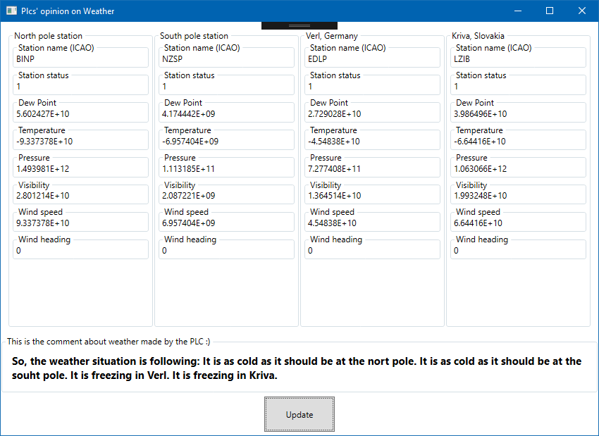

**N.B. ALL EXAMPLES ARE NOW IN VS2019 FORMAT**

# Weather stations

In this example we are showing the ease with which you can use the power of .NET ecosystem with the PLC. We are reading the data from some weather stations from around the world (via .net library) and we pass the data to the PLC. Plc then makes its own statements about the weather situation in different parts of the world.

Console application shows different ways to access PLCs' variables (Cyclical, Synchronous, Batched). There are descriptive comments in the code that should help you grasp basic concepts.

In addition this project demonstrates the ability to localize PLC strings in easy and straightforward way. The framework takes care of translating PLC STRING, WSTRING at runtime using applications' resources. Notice that localizable PLC strings are enclosed between <# and #>.

# How it looks like

# Need help?

🧪 Create an issue [here](https://github.com/Inxton/Feedback/issues/new/choose)

📫 We use mail too team@inxton.com 

🐤 Contact us on Twitter [@Inxton](https://twitter.com/inxtonteam)

📽 Checkout our [YouTube](https://www.youtube.com/channel/UCB3EcnWyLSsV5gqSt8PRDXA/featured)

🌐 For more info check out our website [INXTON.com](https://www.inxton.com/)

# Contributing

We are more than happy to hear your feedback, ideas!
Just submit it [here](https://github.com/Inxton/Feedback/issues/new/choose)  
 

# License
tldr
> Developers are encouraged to use this project -  free of charge, although when you want to use it in production enviroment you need to go to  [INXTON.com](https://www.inxton.com/) and purchase a licence.

to make our lawyers happy - read the whole licence agreement [here](https://github.com/Inxton/about/blob/master/license.md)

---
Developed with ♥ at [MTS](https://www.mts.sk/) - putting the heart into manufacturing.
 
